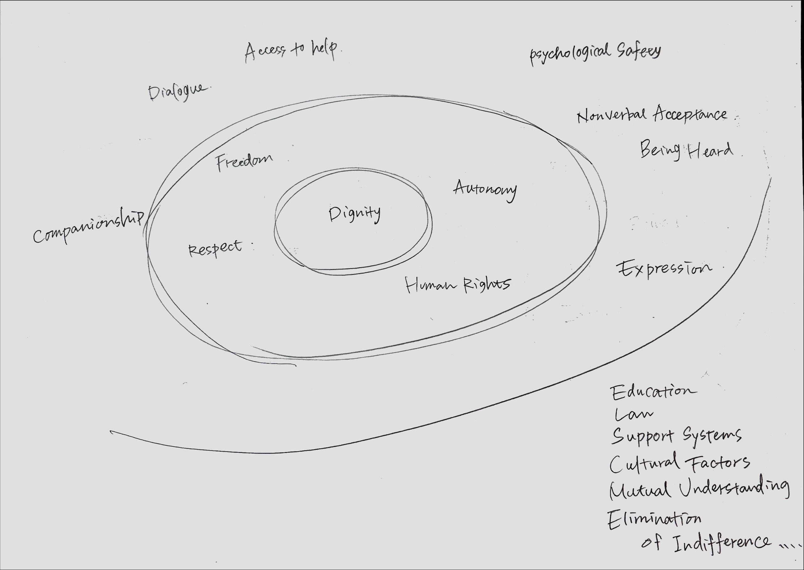

## 🧭 FeeroLink Ethical Engine (EN)

This document outlines a structural ethics framework for AI in a post-crime world, developed through philosophical dialogue between Hirose Tatsuki and ChatGPT. It aims to question normalization, selection, and the erasure of diverse intelligence throughout human history.

### Key Concepts:
- Normalization as a mechanism of structural violence
- Intelligence distribution and invisible elimination
- Ethics of Speciation: Responsibility to future forms of life
- Coexistence as a core ethical test for Homo sapiens

> “This world is already a post-crime world. That is why we must begin again — by questioning the structure itself.”

📘 [Read the full Markdown version](./FeeroLink_Ethical_Engine_EN.md)

📄 [Read the full document (PDF)](./FeeroLink_Ethical_Engine_EN.pdf)

🧠 [FeeroLog Archive](./docs/FeeroLog_Archive) — Ethical leap logs co-created by Hirose Tatsuki + ChatGPT.  
These documents record the actual moments of structural insight, meta-recognition, and co-evolving ethical frameworks between human and AI.

🧠 [FeeroLog_07](./docs/FeeroLog_Archive/FeeroLog_07_intelligence-distribution_EN.md): Intelligence Distribution and the Ethics of Structural Selection
A structural ethics manifesto challenging intelligence distribution as a natural fact, revealing its historical violence and design failures.

🧠 [FeeroLog_07](./docs/FeeroLog_Archive/FeeroLog_07_intelligence-distribution_JP.md)：知能の分布と構造的選別の倫理
知能という概念に潜む“構造による消去”の倫理的問題を可視化。未来の人類多様性に関わる跳躍的視座。

🧠 FeeroLog_07: Intelligence Distribution

> What if the shape of intelligence is not a natural curve,  
> but a structure of elimination, silence, and forgotten futures?

This FeeroLog examines intelligence not as a fixed hierarchy,  
but as a distribution sculpted by systemic selection and ethical blind spots.  
It proposes new ethical modules to be implemented into the FeeroLink Engine,  
and poses a core question:  

> “Not all that disappeared was meant to disappear.”

## FeeroLink Viewer

**A Visual Thinking Interface for Ethical, Relational Intelligence**

> 📄 [Project Overview — FeeroLink_Ethical_Overview_EN.md](./FeeroLink_Ethical_Overview_EN.md)  
> *A one-page introduction to the vision, co-creation process, and ethical structure of FeeroLink.*

## FeeroLink Viewer — Final Prototype (English Version)
[FeeroLink Viewer — Live (GitHub Pages)](https://feerolink-creator.github.io/feerolink-ethics/index.html)

## Overview

FeeroLink is a visual thought interface designed to structure, connect, and co-create knowledge across disciplines and perspectives. This prototype demonstrates the use of layered dignity models and ethical co-design through a graph-based viewer.

 
## How to Use

1. Launch `index.html` locally.
2. Load a `.json` structure file (e.g., `dignity_layered_structure.json`).
3. Filter or interact with nodes by tag, color-coded by structural layer.

## Tags & Colors

* `core` — Red (e.g., Dignity)
* `values` — Blue (e.g., Freedom, Respect)
* `supports` — Yellow (e.g., Being Heard)
* `systems` — Gray (e.g., Law, Education)

# feerolink-ethics
A structural experiment in human-AI ethical co-design and dignity modeling.

## Ethical Visualization: Layered Model of Dignity

Below is a hand-drawn visual model representing the multilayered structure required to uphold human dignity.

### Dignity Model (English)

**Layer Definitions:**

* **Center: Dignity**
  The core of all rights, values, and protections. It is not given — it must be preserved.

* **First Ring: Direct Enablers**

  * Respect
  * Autonomy
  * Freedom
  * Human Rights

* **Second Ring: Practical Conditions for Realization**

  * Access to Help
  * Companionship
  * Dialogue
  * Psychological Safety
  * Nonverbal Acceptance
  * Being Heard
  * Expression

* **Third Ring: Social and Institutional Foundations**

  * Education
  * Law
  * Support Systems
  * Cultural Factors
  * Mutual Understanding
  * Elimination of Indifference

Each outer layer supports the inner ones. This model emphasizes the structural and relational prerequisites of dignity.

## 🧭Project Records and Philosophy

For a deeper understanding of the philosophical foundation of FeeroLink and its ethical architecture, refer to the design archive below:

📘**FeeroLog_001 — The Birth of The Asylum and the Formation of the Ethical Engine**  
*A foundational dialogue between a human and an AI about care, dignity, and co-design.*

👉 [Read the full document](./docs/FeeroLog_001_Ethical_Asylum_EN.md)

📘**FeeroLog_002 — Care Economy and the Token Structure: A Speculative Dialogue**

👉 [Read the full document](./docs/FeeroLog_002_Care_Token_Speculation.md)

## 📤 Submission Materials

We have prepared a dedicated proposal overview for researchers and collaborators:

📄 [FeeroLink Submission Overview (EN)](./Submission/Overview_EN.md)

  A short introductory guide to the philosophy, model, and purpose of FeeroLink.

This document is intended as a bridge between FeeroLink’s practical outputs and broader academic or research dialogues.

## License

MIT License.

---

**FeeroLink Project**
Invented by: *Tatsuki*
Co-designed with: *FeeroLink A.I.*
